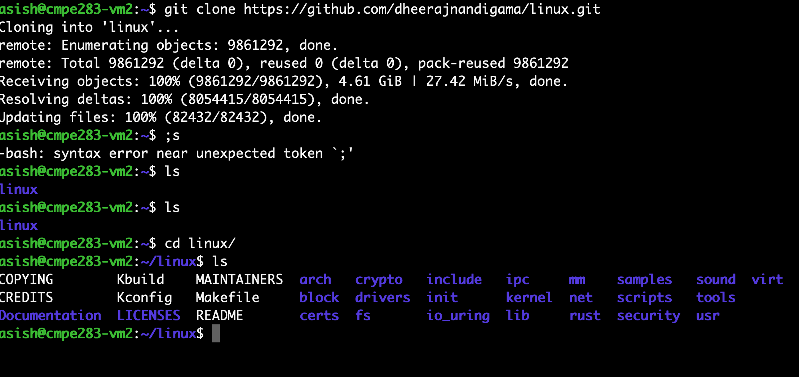

## CMPE-283 Assignment - 1

### Overview

In this assignment we will create a linux kernal module to query diffrent MSR's to figure out diffrent virtualization features available to the CPU.

For this assignment we have enabled a GCP VM based on linux operating system. We verify the MSR's by inserting a new module to the kernal and discover its features by the features it discovers.

### Contribution 

#### Asish's Contribution
 
Dheeraj and I collaborated over meeting rooms at SJSU. I began by setting up an virtual machine on GCP Cloud. After that, I set up my github on the vm to make updation and version control easy. Then i moved on with cloning the linux github repo the Makefile and the.c file to my virtual machine (VM). I then searched for various capability regions in SDM, as well as report_capability and the remaining msrs for each capability.

#### Dheeraj's Contribution

In a meeting, Asish and I went over the specifics of the task and watched the assignemtn 1 video that covered the requisites. I loaded the makefile and starter.c file into the VM provided by Asish, then I started adding the last four struct definitions for the various capability info areas. I added the four last msrs readings for each capability to the detect_vmx_features function, and then I added the calls to report_capability. I then attempted to run make and sudo insmod on the freshly created.ko file in order to do testing.


### Procedure

1. Create a GCP account and avail your $300 free credits with the sjsu.edu account.
2. After the $300 credit is offered we activate the cloud shell and run the follwoing command
    ```
    gcloud compute instances create cmpe283-vm4  --enable-nested-virtualization  --zone=us-west4-b --machine-type=n2-standard-8 --network-interface=network-tier=PREMIUM,subnet=default --create-disk=auto-delete=yes,boot=yes,device-name=instance-1,image=projects/ubuntu-os-cloud/global/images/ubuntu-2004-focal-v20220204,mode=rw,size=200 --metadata=ssh-keys=asish:"ssh-ed25519 xxxxxxxxxxx"
    ```
    the following command will creat a GCP CM instance with 16 gb of ram and 200GB of disk space.
    
3. Now we ssh into our newly created instance and install git and other necessary tools using the command below
    ```
    sudo apt-get install git
    sudo apt-get install gcc
    sudo apt-get install make
    ```
4. Once the following is done now we clone the linux repo from github

5. Then we clone our github repo

6. Now we check for available virtualization flags available in our operating system.

7. Now we modify the `cmpe283-1.c` to add other MSR directories  as mentioned below
    ```c
    struct capability_info pinbased[5] =
    {
        { 0, "External Interrupt Exiting" },
        { 3, "NMI Exiting" },
        { 5, "Virtual NMIs" },
        { 6, "Activate VMX Preemption Timer" },
        { 7, "Process Posted Interrupts" }
    };
    ```

    ```c
    struct capability_info procbased[21] =
    {
        { 2, " Interrupt-window exiting" },
        { 3, "Use TSC offsetting " },
        { 7, "HLT exiting " },
        { 9, "INVLPG exiting " },
        { 10, "MWAIT exiting" },
        { 11, "RDPMC exiting" },
        { 12, "RDTSC exiting" },
        { 15, "CR3-load exiting" },
        { 16, "CR3-store exiting" },
        { 19, "CR8-load exiting" },
        { 20, "CR8-store exiting" },
        { 21, "Use TPR shadow " },
        { 22, "NMI-window exiting" },
        { 23, "MOV-DR exiting" },
        { 24, "Unconditional I/O exiting" },
        { 25, "Use I/O bitmaps " },
        { 27, "Monitor trap flag " },
        { 28, "Use MSR bitmaps" },
        { 29, "MONITOR exiting" },
        { 30, "PAUSE exiting" },
        { 31, "Activate secondary controls" }
    }; 
    ```

    ```c
    struct capability_info secondary_procbased[23] =
    {
        { 0, " Virtualize APIC accesses" },
        { 1, "Enable EPT " },
        { 2, "Descriptor-table exiting " },
        { 3, "Enable RDTSCP " },
        { 4, "Virtualize x2APIC mode" },
        { 5, "Enable VPID" },
        { 6, "WBINVD exiting" },
        { 7, "Unrestricted guest" },
        { 8, "APIC-register virtualization" },
        { 9, "Virtual-interrupt delivery" },
        { 10, "PAUSE-loop exiting" },
        { 11, "RDRAND exiting " },
        { 12, "Enable INVPCID" },
        { 13, "Enable VM functions" },
        { 14, "VMCS shadowing" },
        { 15, "Enable ENCLS exiting " },
        { 16, "RDSEED exiting " },
        { 17, "Enable PML" },
        { 18, "EPT-violation #VE" },
        { 19, "Conceal VMX non-root operation from Intel PT" },
        { 20, "Enable XSAVES/XRSTORS" },
        { 22, "Mode-based execution control for EPT" },
        { 25, "Use TSC scaling" }
    }; 
    ```

    ```c
    struct capability_info entry_controls[9] =
    {
        { 2, "Load debug controls" },
        { 9, "IA-32e mode guest" },
        { 10, "Entry to SMM" },
        { 11, "Deactivate dual-monitor treatment " },
        { 13, "Load IA32_PERF_GLOBAL_CTRL" },
        { 14, "Load IA32_PAT" },
        { 15, "Load IA32_EFER" },
        { 16, "Load IA32_BNDCFGS" },
        { 17, "Conceal VM entries from intel PT" }
    };
    ```

    ```c
    struct capability_info exit_controls[11] =
    {
        { 2, "Save debug controls" },
        { 9, "Host address-space size" },
        { 12, "Load IA32_PERF_GLOB AL_CTRL" },
        { 15, "Acknowledge interrupt on exit " },
        { 18, "Save IA32_PAT" },
        { 19, "Load IA32_PAT" },
        { 20, "Save IA32_EFER" },
        { 21, "Load IA32_EFER" },
        { 22, "Save VMX-preemption timer value" },
        { 23, "Clear IA32_BNDCFGS" },
        { 24, "Conceal VM exits from Intel PT" }
    };
    ```

    inside the `detect_vmx_features()` function we make these required changes to output the MSR capabilities.

    ```c
    /* Pinbased controls */
	rdmsr(IA32_VMX_PINBASED_CTLS, lo, hi);
	pr_info("Pinbased Controls MSR: 0x%llx\n",
		(uint64_t)(lo | (uint64_t)hi << 32));
	report_capability(pinbased, 5, lo, hi);


	/* Procbased controls */
	rdmsr(IA32_VMX_PROCBASED_CTLS, lo, hi);
	pr_info("Procbased Controls MSR: 0x%llx\n",
		(uint64_t)(lo | (uint64_t)hi << 32));
	report_capability(procbased, 21, lo, hi);

        /* Secondary Procbased2 controls */ 
	rdmsr(IA32_VMX_PROCBASED_CTLS2, lo, hi);
	pr_info("Secondary Procbased Controls MSR: 0x%llx\n",
		(uint64_t)(lo | (uint64_t)hi << 32));
	report_capability(secondary_procbased,23, lo, hi);


	/* Entry controls */
	rdmsr(IA32_VMX_ENTRY_CTLS, lo, hi);
	pr_info("Entry Controls MSR: 0x%llx\n",
		(uint64_t)(lo | (uint64_t)hi << 32));
	report_capability(entry_controls, 9, lo, hi);


	/* Exit controls */
	rdmsr(IA32_VMX_EXIT_CTLS, lo, hi);
	pr_info("Exit Controls MSR: 0x%llx\n",
		(uint64_t)(lo | (uint64_t)hi << 32));
	report_capability(exit_controls, 11, lo, hi);
    ```

8. After the following modification is made we compile the C code using the make file provided.
    ```bash
    sudo make 
    sudo cmpe283-1.ko
    sudo dmesg
    ```


9. The Pin-Based VM-Execution Controls output

    

10. The Processor based VM Execution Controls output

    

11. The Entry control VM-Execution Control output

    

12. The Exit control VM-Execution Control output

    