## CMPE-283 Assignment - 2

### Github Link : [Assignment-2](https://github.com/dheerajnandigama/CMPE-283/tree/main/Assignment-2)

### Overview

In this assignment we will modify the CPUID emulation code in KVM, for this assignment we will go with 2 leaf node that is `0x4FFFFFFD` and `0x4FFFFFFC` with some predefined rules for the output. For leaf nodes `0x4FFFFFFD` and `0x4FFFFFFC`, if %ecx (on input) contains a value not defined by the SDM, return 0 in all %eax, %ebx, %ecx registers and return 0xFFFFFFFF in %edx. For exit types not
enabled in KVM, return 0s in all four registers.

### Contribution 

Vachavaya Asish Raju - 016943433
Dheeraj Nandigama - 017402203

#### Asish's Contribution
 
I created a new GCP-VM instance as we encountered some space issue due to building the kernal for linux, I cloned the torvalds/linux repository that Dheeraj had forked, I started by installing all the required tools to compile and build a kernal. Next, I modified kvm_emulate_cpuid to include the leaf function, and in the process, I read up on atomic variables. In order to test my code, I also installed Virt-Manager which would enable run a virtual manager inside VM.

#### Dheeraj's Contribution

I went over how to obtain and build the Linux kernel and spoke about the next steps needed to finish the assignment. I locally cloned and forked the Linux kernel repository in my development environment, then I started tinkering with the cpuid.c file in KVM by adding a leaf function to kvm_emulate_cpuid. I practiced creating the kernel and getting a nested virtual machine ready for testing in parallel. I configured GCP to provide display output as we would need it to run an virtualized ubuntu instance within our VM connected via chrom remote desktop.


### Procedure

1. Created new VM in GCP cloud.
    ```
    gcloud compute instances create cmpe283-vm2 --enable-nested-virtualization  --zone=us-west4-b --machine-type=n2-standard-8 --network-interface=network-tier=PREMIUM,subnet=default --create-disk=auto-delete=yes,boot=yes,device-name=instance-1,image=projects/ubuntu-os-cloud/global/images/ubuntu-2004-focal-v20220204,mode=rw,size=200 --metadata=ssh-keys=asish:"ssh-ed25519 xxxxxxxxxxx"
    ```
    the following command will create a GCP CM instance with 16 gb of ram and 200GB of disk space.
    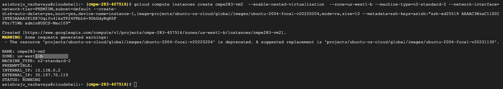
2. Now we ssh into our newly created instance and install git and other necessary tools using the command below
    ```bash
    sudo apt-get install git
    sudo apt-get install gcc
    sudo apt-get install make
    ```
3. Once the following is done now we clone the linux repo from github
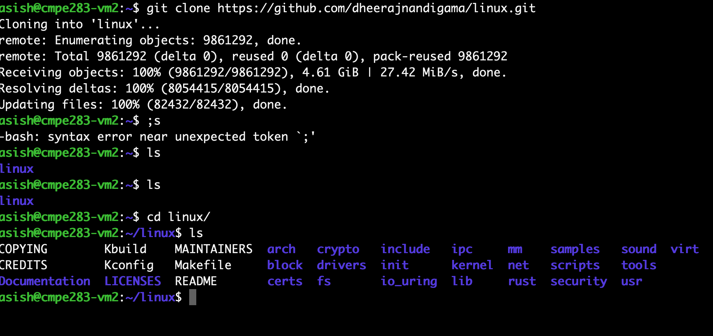

4. Then we clone our github repo
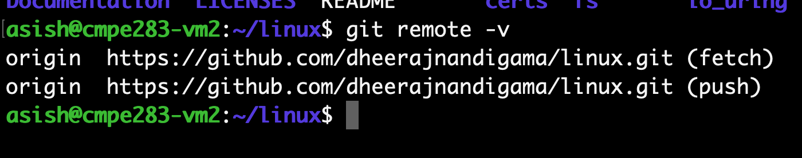

5. We check the current installed kernal in our VM using the below command
    ```bash
    uname -a
    ```

    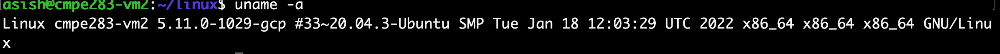

6. Once the required files are present we move our cwd to `cd linux` and run the follwing command 
    ```bash
    cp /boot/config-5.11.0-1029-gcp ~/linux/.config
    ```

7. `sudo nano .config` to edit the following lines 
    ```
    CONFIG_SYSTEM_REVOCATION_KEYS=""

    CONFIG_SYSTEM_TRUSTED_KEYS="" 
    ```

8. now we will make our kernal using the config we just added, will press enter to default all values as this step will ask for many questions. 
    ```bash 
    make oldconfig
    ```
9. once config has been built now we build our kernal modules and install the built kernal

    ```bash
    make -j 8 modules && make -j 8
    ```

10. After the modules and kernal is built we install them

    ```bash
    make -j 8 modules_install && make -j 8 install
    ```

    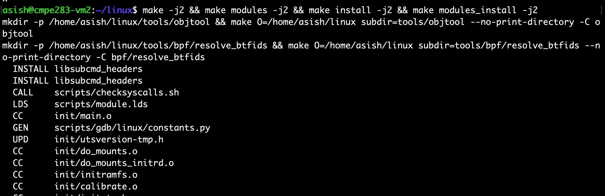

11. Now we reboot the VM for the new kernal to take place

    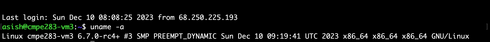

    
12. Now since our kernal is in place we install required tools to initate a innver VM running on a GCP-VM.

    ```bash
    sudo apt install qemu-kvm
    sudo apt install libvirt-clients
    sudo apt install libvirt-daemon-system
    sudo apt install bridge-utils
    sudo apt install virt-manager
    ```

13. Once the required tools are installed, we now modify the code to report back some additional information with the CPUID leaf node. Change the cwd to 
`~/linux/arch/x86/kvm/vmx/vmx.c` and modify the file to add counters 

  ```c
    extern atomic_t total_exits_counter;
    extern atomic64_t total_cup_cycles_counter;

    static int vmx_handle_exit(struct kvm_vcpu *vcpu, fastpath_t exit_fastpath)
    {
       
        uint64_t begin_time_stamp_counter, end_time_stamp_counter;
        int ret;

        arch_atomic_inc(&total_exits_counter);
        begin_time_stamp_counter = rdtsc();

        ret = __vmx_handle_exit(vcpu, exit_fastpath);

        end_time_stamp_counter = rdtsc();
       
        arch_atomic64_add((end_time_stamp_counter - begin_time_stamp_counter), &total_cup_cycles_counter);

    }
 ```


14.  we then modify the `~/linux/arch/x86/kvm/cpuid.c`

    ```c

    int kvm_emulate_cpuid(struct kvm_vcpu *vcpu)
    {
        u32 eax, ebx, ecx, edx;

        if (cpuid_fault_enabled(vcpu) && !kvm_require_cpl(vcpu, 0))
            return 1;

        eax = kvm_rax_read(vcpu);
        ecx = kvm_rcx_read(vcpu);

        switch(eax) {
            case 0x4FFFFFFC:
                eax = arch_atomic_read(&total_exits_counter);
                break;

            case 0x4FFFFFFD:
                ebx = (atomic64_read(&total_cup_cycles_counter) >> 32);;
                ecx = (atomic64_read(&total_cup_cycles_counter) & 0xFFFFFFFF);

                break;

            default:
                kvm_cpuid(vcpu, &eax, &ebx, &ecx, &edx, false);
            }

                kvm_rax_write(vcpu, eax);
    }


    ```

15.  Once the files are modified we again build our kernal to try it in inner VM.

    ```bash
    make -j8 modules && make -j8 modules_install && make install
    ```

16. now we unload kvm kernal and load the kernal we just built using the following commands

    ```bash
    rmmod arch/x86/kvm/kvm-intel.ko
    rmmod arch/x86/kvm/kvm.ko
    insmod arch/x86/kvm/kvm.ko
    insmod arch/x86/kvm/kvm-intel.ko
    ```

17. Enable display driver inside GCP VM to get access of virt-manager which would install a vm inside it.
    

18. Using the chrom remote desktop console, we connect to our vm ip address to get display output and try to run `virt-manager` to install ubuntu.

    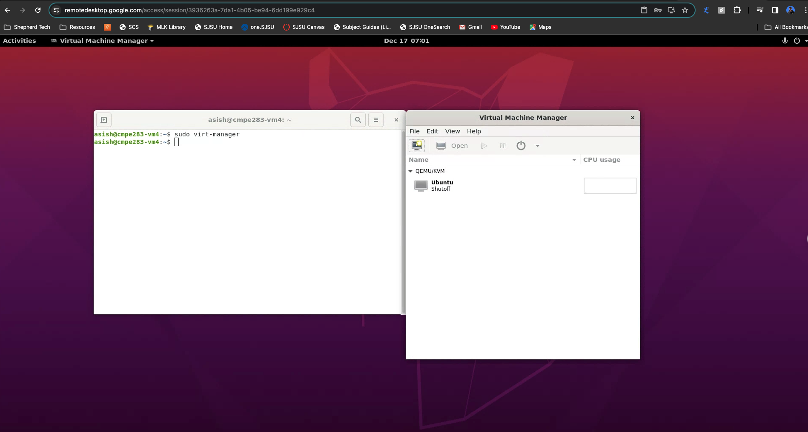

    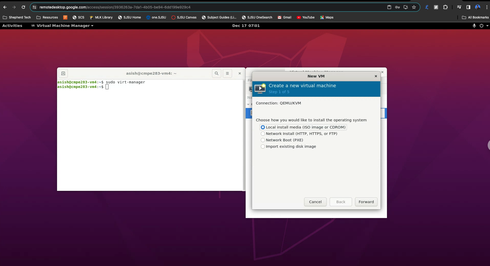

    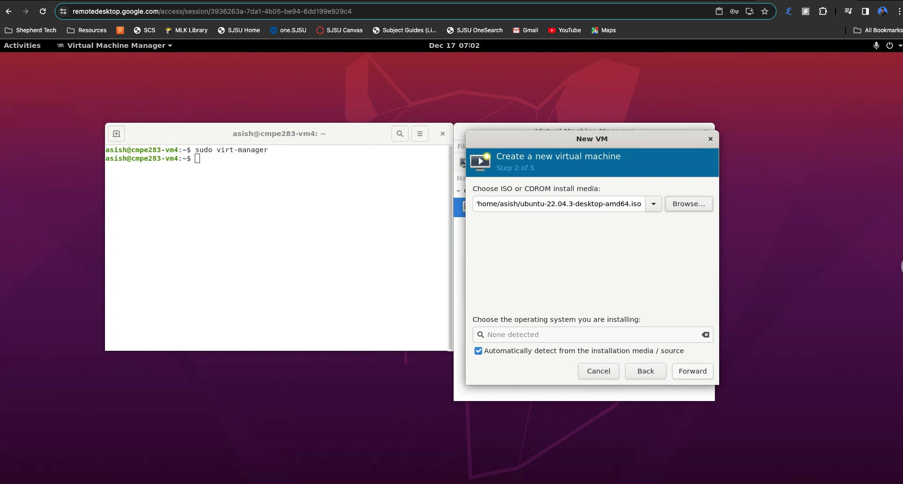

    

    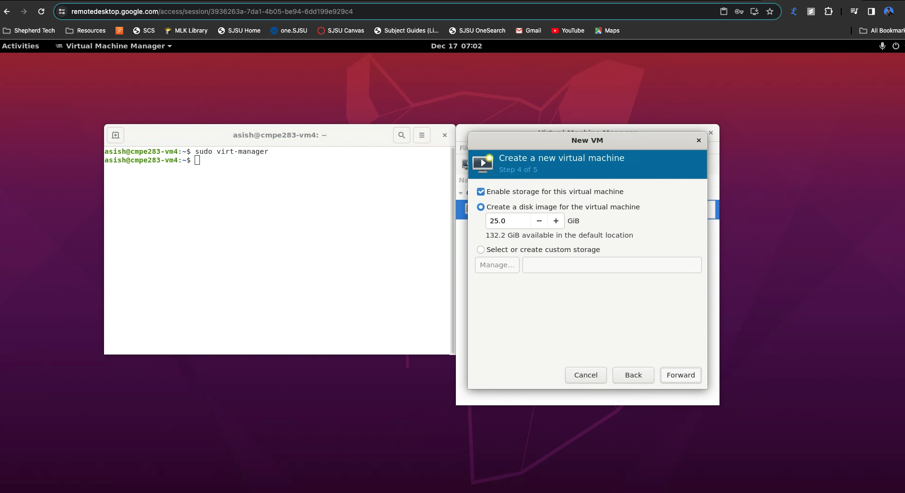

    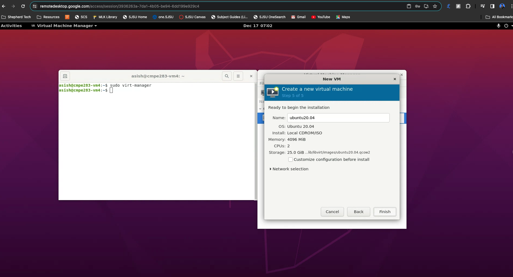

19. Once the VM is setup we install ubuntu and install necessary tools
    ```bash
    sudo apt-get update
    sudo apt-get install git
    sudo apt-get install make
    sudo apt-get install build-essential
    sudo apt-get install cpuid
    ```

20. Now we write a test .c file to test and its corresponding makefile and run the following command.

    ```bash
    make
    make run
    ```

21. The test output is as follows

    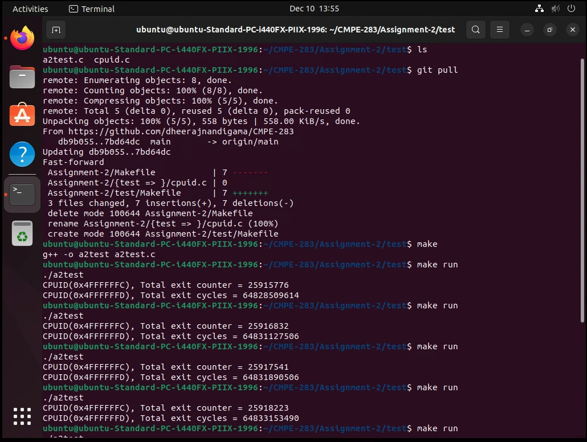

    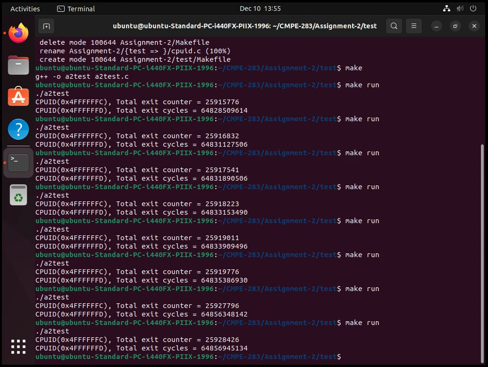

### Answers

Q1. Does the number of exits increase at a stable rate?

```
No, no of exits dont increase or decrease at a stable rate, some of stay the same, the delta between the increase and decrease is also not the same.
```

`>> other questions answered in assignment 3`

