## CMPE-283 Assignment - 2

### Github Link : [Assignment-3](https://github.com/dheerajnandigama/CMPE-283/tree/main/Assignment-3)

### Overview

In this assignment we will modify the CPUID emulation code in KVM, for the remaining 2 leaf nodes `0x4FFFFFFE` and `0x4FFFFFFF`, by following some predefined rules set by SDM.

### Team Members

Vachavaya Asish Raju - 016943433

Dheeraj Nandigama - 017402203

### Contribution 

#### Asish's Contribution
 
I cmodified the code in vmx.c to track the exit types by exit reason and also edit the cpuid.c to support the new LEAF node, also created a test c code to for the specefic exit counts.

#### Dheeraj's Contribution

Investigated exit kinds that are not enabled in the KVM and not specified by the SDM. and modified cpuid.c to handle the exit kinds appropriately. Install the CPUid package and learn about its applications. Made a user application that prints the count for a given exit cause and added updates to the documentation.


### Procedure

1. We use the same environment used for the assignment-2

2. Switch to the linux working directory and update the following files `vmx.c` and `cpuid.c` to update the following leaf node `0x4FFFFFFE` and `0x4FFFFFFF`

3. After modifying the `vmx.c` and `cpuid.c` we now modify the header file with some constant values

4. Now we build our kernal again and remove and load the kvm intel module again.

    ```bash
    make -j 8 modules && make -j modules_install && make
    rmmod kvm_intel
    rmmod kvm
    insmod arch/x86/kvm/kvm.ko
    insmod arch/x86/kvm/kvm-intel.ko
    ```

5. Reboot the VM

6. Start your inner VM and write a small .c file to test the output result along with its makefile.

7. Run the test file

    ``` bash
    make
    make run
    ```

    `0x4FFFFFFE` - test output

    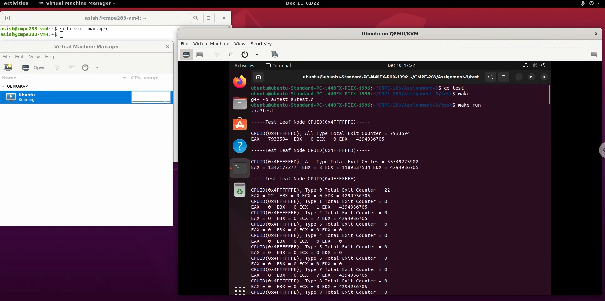

    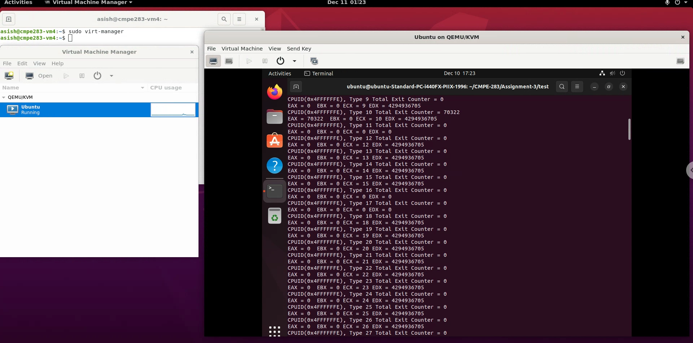

    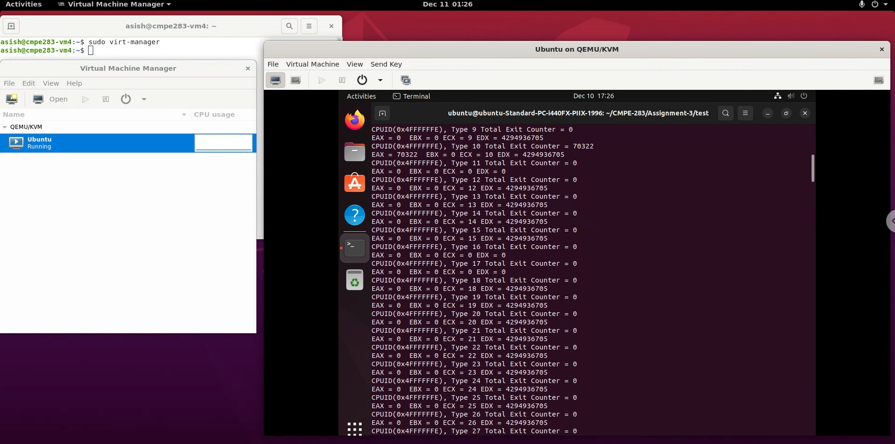

    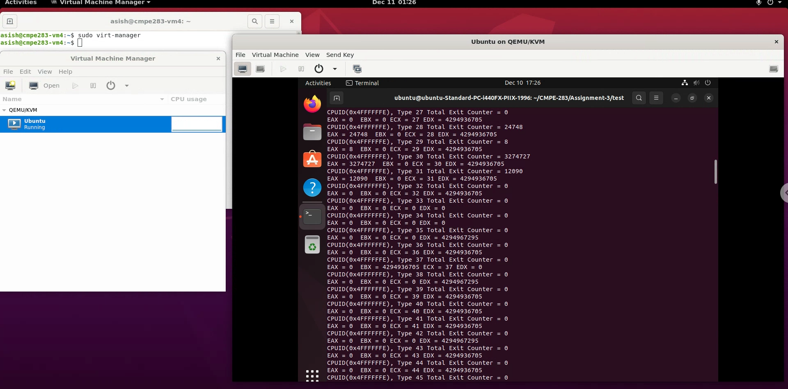

    `0x4FFFFFFF` - test output

    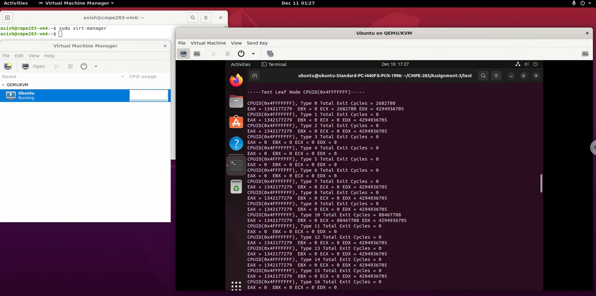

    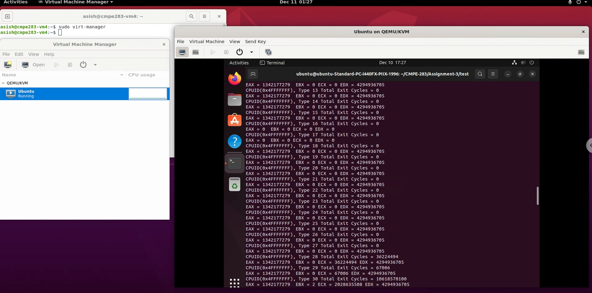

    


8. Now in outer VM we run the follwoing command `sudo dmesg`

    `0x4FFFFFFE` - output

    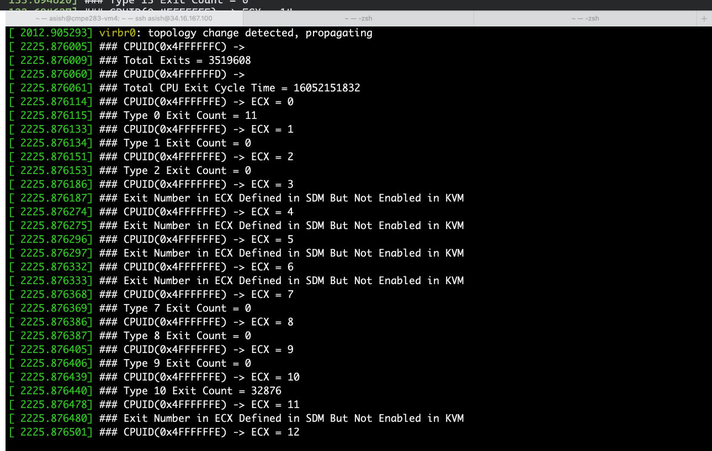

    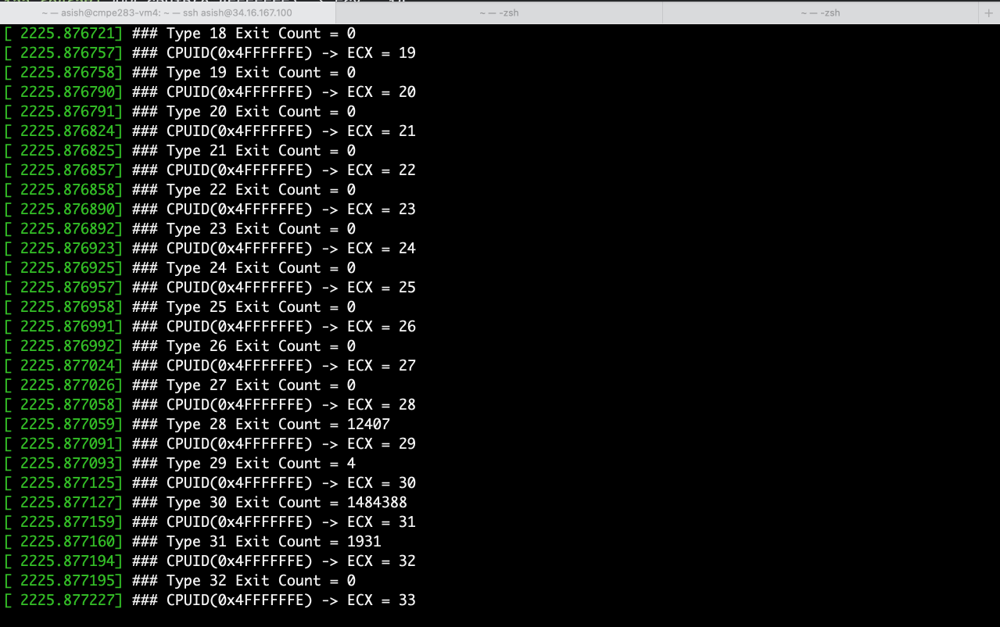

    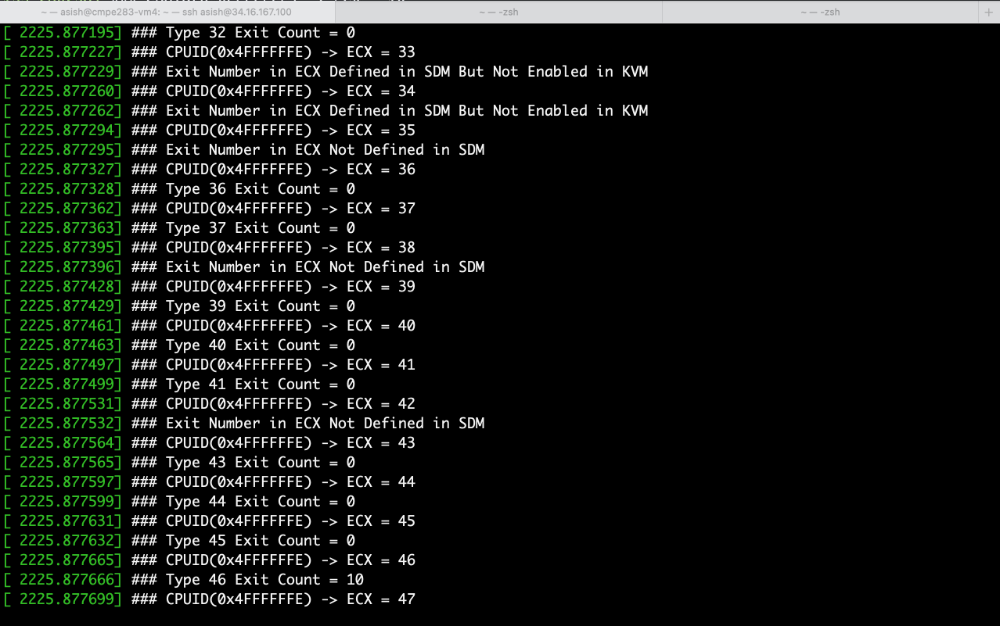

    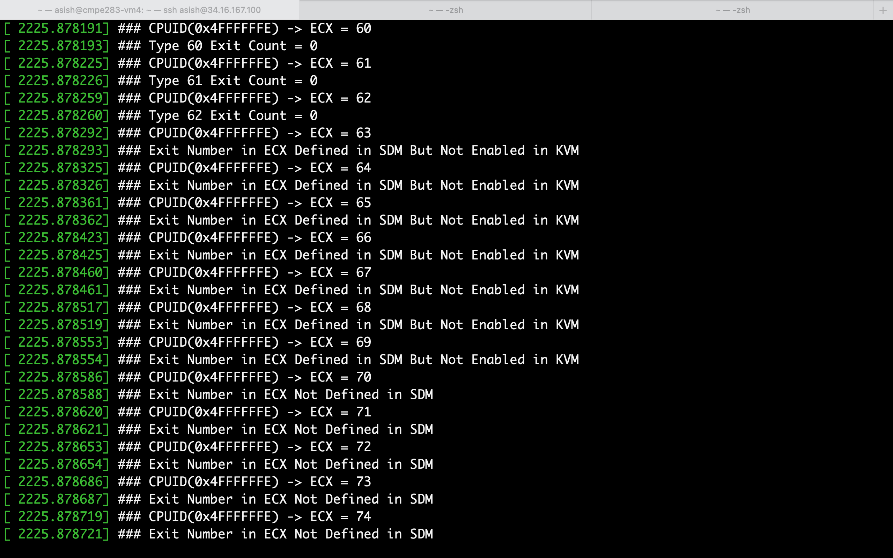

    `0x4FFFFFFF` - output

     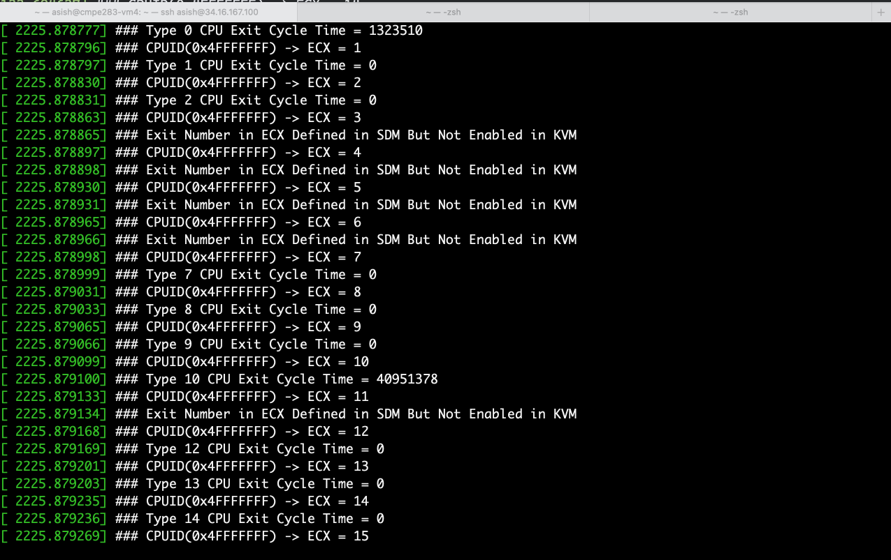

    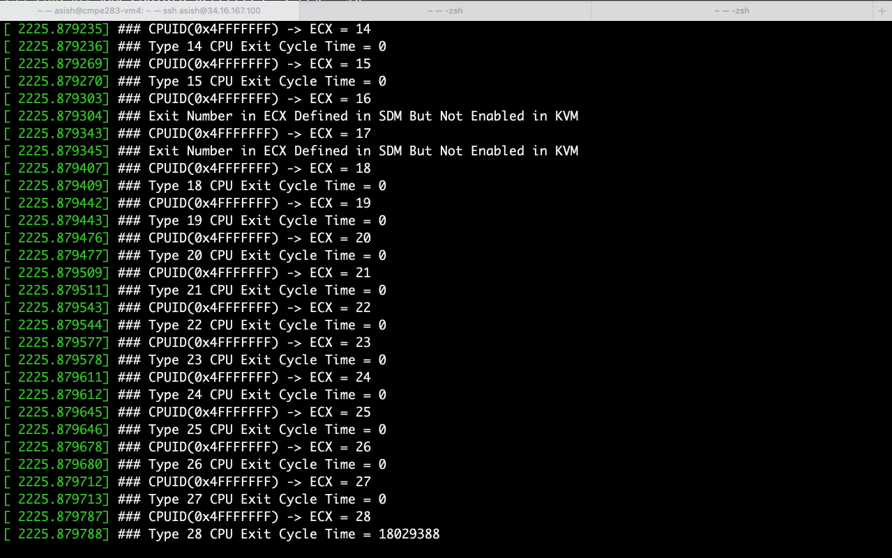

    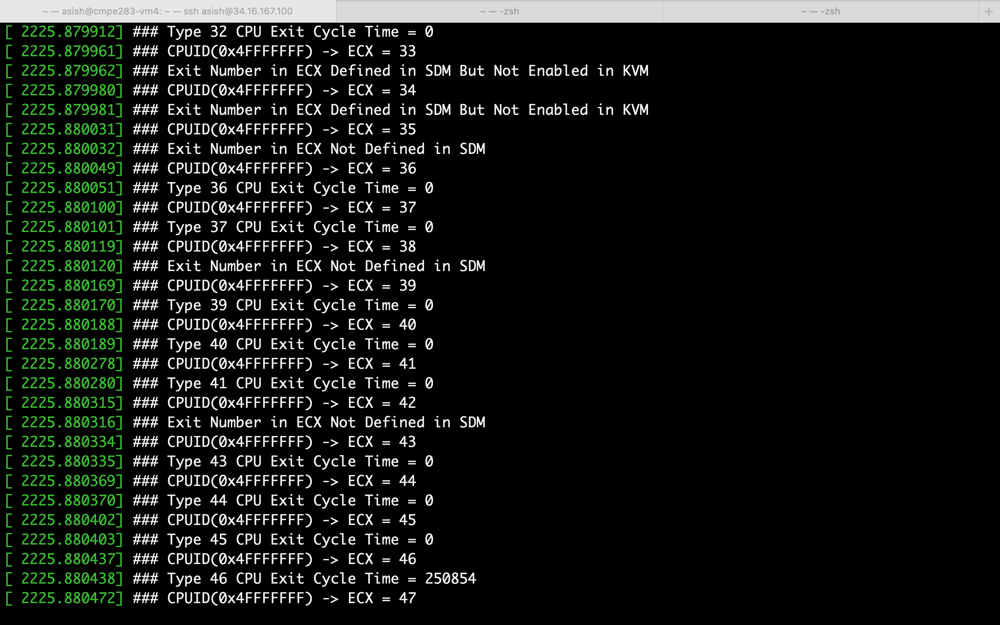

    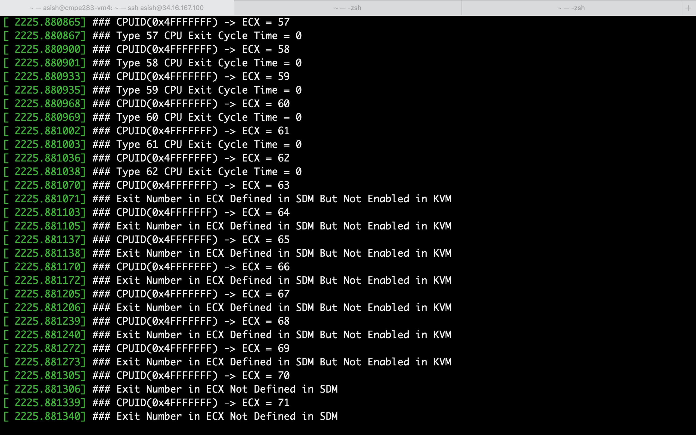

    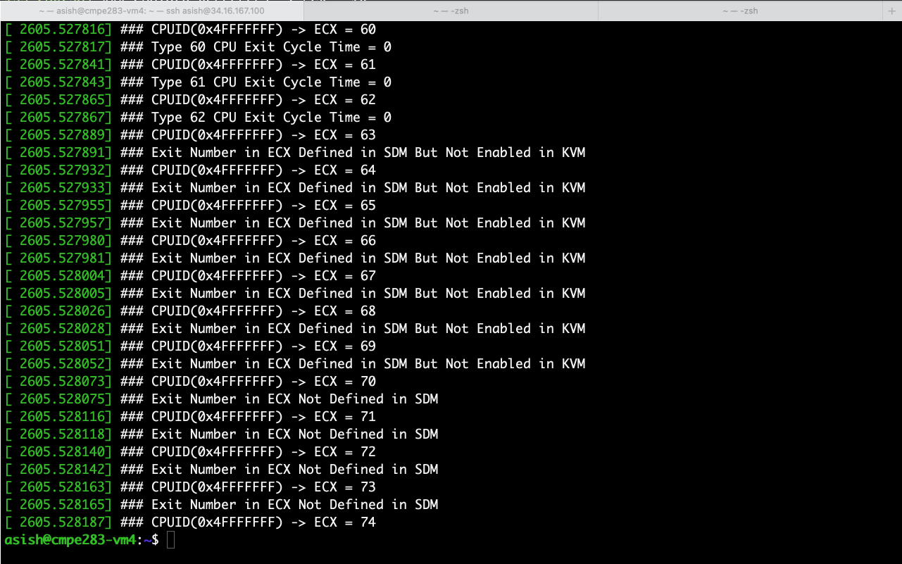


### Answers

Q1. Are there more exits performed during certain VM operations?

```
EXIT_REASON_CPUID, EXIT_REASON_IO_INSTRUCTION and other few perform more exits at certain period of time.   
```

Q2. Approximately how many exits does a full VM boot entail?

```
Around 35549275902 cycle times with 7933594 exits
```

Q3. Of the exit types defined in the SDM, which are the most frequent? Least?

```
EXIT_REASON_DR_ACCESS -  happens for the least
EXIT_REASON_EPT_VIOLATION -  happens the highest no of times
```


